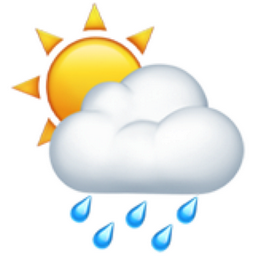

# 🌦️ Smart Weather Forecast Application

<p align="center">
  
</p>

## 📌 Overview

The **Smart Weather Forecast Application** is a desktop application developed using **Python Tkinter**. It provides current weather conditions and a 10-day weather forecast for any city using the WeatherAPI.

---

# 📸 Application Preview

## 🏠 Home Screen

<p align="center">

</p>

---

## 🌤️ Current Weather

<p align="center">

</p>

---

## 📅 10-Day Weather Forecast

<p align="center">

</p>

---

# ✨ Features

- Search weather by city name
- Real-time weather updates
- Current temperature
- Humidity
- Wind speed
- Weather condition
- Weather icons
- Scrollable 10-day forecast
- User-friendly interface
- Error handling

---

# 🖥️ Built With

| Technology | Purpose |
|------------|---------|
| Python | Programming Language |
| Tkinter | GUI |
| Requests | API Calls |
| Pillow | Image Processing |
| WeatherAPI | Weather Data |
| Dotenv | API Key Security |

---

# 📂 Project Structure

```
Smart_Weather_App/
│
├── weather.py
├── requirements.txt
├── .env
├── .gitignore
├── README.md
│
├── images/
│   ├── banner.jpg
│   ├── home_screen.png
│   ├── current_weather.png
│   ├── forecast.png
│   └── workflow.png
│
├── sun.png
├── cloud.png
├── rain.png
├── storm.png
├── fog.png
└── weather.png
```

---

# ⚙️ Installation

```bash
git clone https://github.com/Sushmitha2406/smart_weather_condition.git
```

```bash
cd smart_weather_condition
```

```bash
pip install -r requirements.txt
```

---

# 🔑 API Configuration

Create a `.env` file

```env
API_KEY=YOUR_API_KEY
```

---

# ▶️ Run

```bash
python weather.py
```

---

# 📊 Workflow

<p align="center">

</p>

---

# 📖 How It Works

1. User enters city name.
2. WeatherAPI receives the request.
3. JSON weather data is returned.
4. Current weather is displayed.
5. A 10-day forecast is shown with weather icons.

---

# 🚀 Future Enhancements

- Air Quality Index
- GPS Weather
- Hourly Forecast
- Weather Charts
- Dark Mode
- Sunrise & Sunset

---

# 👩‍💻 Author

**Sushmitha**

GitHub: https://github.com/Sushmitha2406

---

# 📄 License

Educational Purpose
